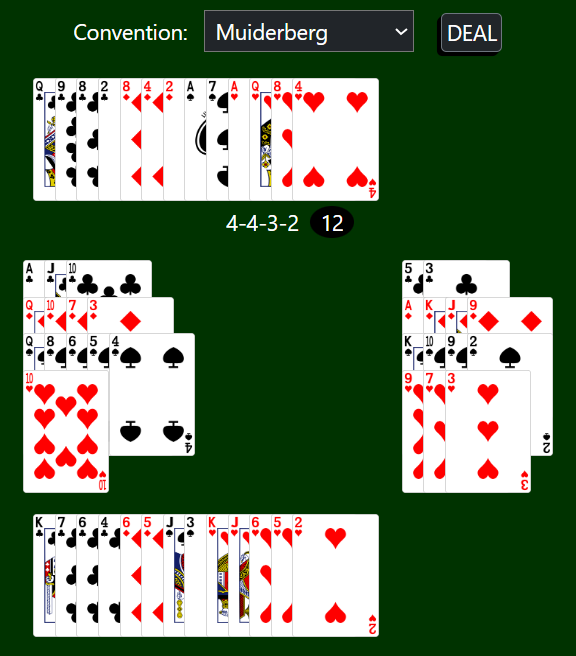

## Intention
A quick and dirty tool to practise bidding for the card game bridge. 
Choose the convention you want to practise and it will simulate an appropriate hand for you to consider. 
I've added a number of conventions, others are easily added to the Deal class. 
I've used Rails, whcih is overkill. It's little more than a few Ruby classes, no database. 

